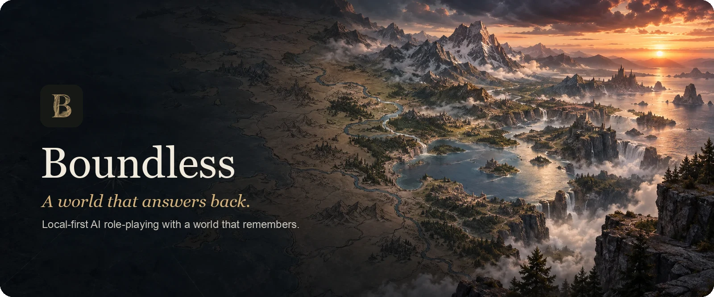
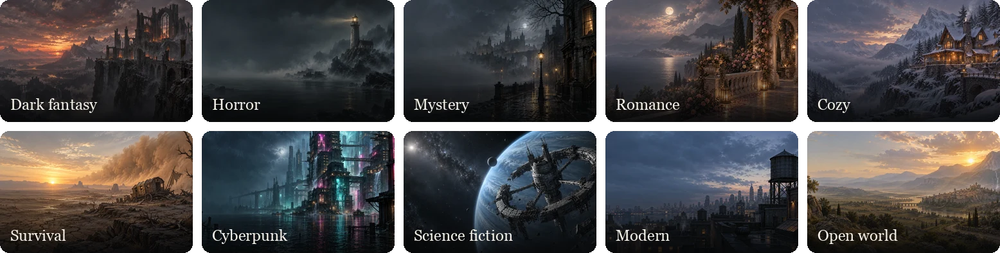
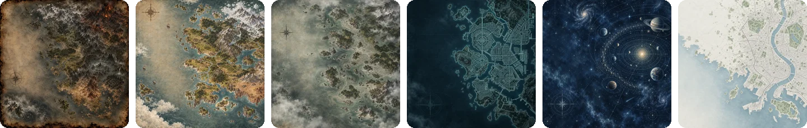
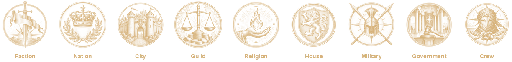
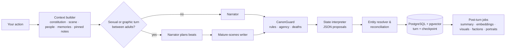

<p align="center">
  
</p>

<p align="center">
  <strong>Describe any world. Become anyone. Do anything — and the world remembers.</strong>
</p>

<p align="center">
  
  
  
  
  
  
  
</p>

<p align="center">
  <a href="#features">Features</a> ·
  <a href="#quick-start">Quick start</a> ·
  <a href="#models">Models</a> ·
  <a href="#portraits">Portraits</a> ·
  <a href="#how-it-works">How it works</a> ·
  <a href="#development">Development</a>
</p>

---

Boundless is a local-first, text role-playing game with an AI Game Master. You write a premise in plain language — a sentence or a page — and play by writing whatever you want to do. The narrator answers in prose, while a separate state engine keeps the world honest: every person, alias, fact, relationship, faction, item, objective and rule is stored in PostgreSQL, reconciled after every turn, and checked before the next one is shown.

Long campaigns are the point. People keep their names when the story reveals them, facts accumulate instead of being overwritten, the dead stay dead, and you can rewrite, branch or rewind any moment without corrupting the timeline.

## Features

<table>
<tr>
<td width="50%" valign="top">

### A world that remembers
- **Entity identity** — one record per person, with aliases, titles and descriptions ("the man in the dark coat") resolved to the right character, and revealed names renaming the existing person instead of creating a duplicate.
- **Merge-safe facts** with provenance, so a weaker or "unknown" update never erases what the story established.
- **Relationships** on nine axes (trust, fear, loyalty, hostility…) between any two people, each change dated with its reason.
- **Objectives, items, places and world time** reconciled from the narration every turn.
- **CanonGuard** checks hard rules, player agency, confirmed deaths and owned items before a turn is saved.

</td>
<td width="50%" valign="top">

### A story you can steer
- **Edit, rewrite, branch, rewind** — with every consequence shown first: which later turns leave the timeline, and a one-click *Branch instead* to keep them.
- **Fix wording** without touching the world, or **change what happened** and let the state re-read.
- **Free writing or offered choices**, switchable at any time.
- **Notebook** for private notes and saved passages; pin up to six and the narrator keeps them in mind — never as canon.
- **Export and import** complete campaigns as versioned `.boundless.json` files.

</td>
</tr>
<tr>
<td valign="top">

### People, factions and a living graph
- **Connection graph** — a force-directed, Obsidian-style map of everyone you know. Drag people and their connections follow; hover to trace a web.
- **Factions, nations, guilds, faiths, houses, armies and crews**, linked from roles, facts and the story itself, with leaders, former members and relations between groups.
- **Allies and enemies** worked out from both sides of a relationship, explicit statuses and faction stances.

</td>
<td valign="top">

### Built for local models
- **Separate AI roles** — narrator, state tracking, summary, canon repair, and an optional **mature-scenes** writer: a smarter GM plans the beats while a local, uncensored model writes the explicit parts — sex and nudity, and graphic violence, gore, torture and injuries — without toning them down.
- Apple Silicon **MLX**, **Ollama**, any **OpenAI-compatible** server (llama.cpp, LM Studio), or hosted **DeepSeek**.
- Hosted fallbacks are **off unless you turn them on**, with a clear note of what would be sent.
- Local hashed embeddings by default; hybrid pgvector memory retrieval.

</td>
</tr>
</table>

### Ten world moods, light and dark

Each world has a mood that sets its palette, light, prose tone and art. Every mood ships in a light and a dark scheme, and while **adaptive mood** is on, the scene's feeling — tense, eerie, tender, triumphant — leans the whole interface as the story moves.

<p align="center">
  
</p>

<p align="center">
  
</p>

### Groups with a seal of their own

<p align="center">
  
</p>

### Characters with faces

Portraits are optional and generated on your own ComfyUI server (or AI Horde). New characters get a stable visual identity from the narration — face, hair, build, clothing, condition — so portraits match the story. Full-length images are generated once; thumbnails zoom onto the detected face and the full figure opens on click. Mature detail is **opt-in and applies only to characters the story establishes as adults**; anyone who is or may be a minor is always portrayed clothed and non-suggestively.

<p align="center">
  
</p>

## Quick start

Requirements: **Docker** with Compose. The images contain no language model — connect one in Settings (see [Models](#models)).

```bash
cp .env.example .env
make stack-up
```

Open **http://localhost:3000**, click **Settings**, connect a model, then **Begin a world**. The composer walks through three short steps — your premise (or a story spark), your character, and the tone — and you can start after the first.

| Command | What it does |
| --- | --- |
| `make stack-up` | Build and start PostgreSQL, migrations, API and web. On Apple Silicon it also starts the MLX host companion. |
| `make stack-logs` | Follow API and web logs. |
| `make stack-down` | Stop the stack. Data volumes are kept. |
| `make repair CAMPAIGN=<id>` | Report (and optionally apply) state repairs for a campaign. |

Health: [`/api/ready`](http://127.0.0.1:8000/api/ready) · [`/api/health`](http://127.0.0.1:8000/api/health) (reports narrator, state and summary models separately).

> [!IMPORTANT]
> Boundless has no accounts. The API, web app and database bind to `127.0.0.1` only — keep it that way on shared networks.

## Models

Choose a provider in **Settings → Models**. Every role can use a different model under **Advanced · AI roles**; each picks from the models the runtime reports as installed.

| Provider | Runs on | Endpoint from native dev | Endpoint from Docker |
| --- | --- | --- | --- |
| MLX | Apple Silicon | `http://127.0.0.1:8088/v1` | `http://host.docker.internal:8088/v1` |
| Ollama | Your machine | `http://127.0.0.1:11434` | `http://host.docker.internal:11434` |
| OpenAI-compatible (llama.cpp, LM Studio…) | Any reachable host | the server's `/v1` URL | a container-reachable `/v1` URL |
| DeepSeek | Hosted | `https://api.deepseek.com` | `https://api.deepseek.com` |

<details>
<summary><strong>AI roles in detail</strong></summary>

| Role | Default | Purpose |
| --- | --- | --- |
| Narrator | the model in Settings | Writes the story. |
| State tracking | inherits narrator | Reads each turn and proposes structured changes; validation, entity resolution and reconciliation keep authority. |
| Summary & memory | inherits state | Keeps the rolling summary current, with a deterministic fallback. |
| Canon repair | inherits narrator | Rewrites a passage that breaks a hard rule. |
| Mature scenes | off | On sexual or graphically violent turns (gore, torture, severe injuries) between adults, the narrator plans the beats and this model writes the prose in full detail. Never used when a scene may involve a minor. |
| Hosted state fallback | off | Used only if the state model fails after a repair attempt, and only when enabled. |

Local state models should run at a low temperature (0–0.1). Test a model against your own campaigns before relying on it for long play; small models can mistake spells for items or miss identity reveals.
</details>

<details>
<summary><strong>Apple Silicon (MLX)</strong></summary>

`make stack-up` starts a small loopback-only companion (port 8091) so the app can launch `mlx_lm.server` on demand. Put models in `~/.local/share/boundless/models`, choose **Apple Silicon · MLX** in Settings, pick a model and click **Start and use MLX server**. The companion never downloads models. To run the server yourself:

```bash
mlx_lm.server --model ~/.local/share/boundless/models/<model-folder> --host 127.0.0.1 --port 8088
```
</details>

<details>
<summary><strong>Ollama</strong></summary>

```bash
ollama pull qwen3.5:9b
```

The model menu reads installed models from `/api/tags`. From Docker, the API reaches the host through `host.docker.internal`; on Linux, make sure Ollama listens on an interface the container can reach, and keep that listener on a trusted network.
</details>

## Portraits

Portrait generation is optional and never blocks a turn: jobs run in a durable queue after the story is saved, and images are copied into Boundless storage.

1. Run [ComfyUI](https://github.com/comfyanonymous/ComfyUI) with an SDXL checkpoint on a machine you control, reachable from the API over localhost, your LAN or Tailscale. Do not expose it to the public internet.
2. In **Settings → Portrait generation**, choose **ComfyUI**, enter its URL, click **Test connection** (it runs from the API, so it tests the real path), and pick a checkpoint.
3. Optionally enable **Allow mature detail in portraits of adults**.

The default workflow is [`boundless_portrait_v1.json`](backend/app/workflows/boundless_portrait_v1.json). Portraits are 832 × 1216 full-length images; faces are detected (OpenCV) for thumbnails. AI Horde, manual upload and a Perchance-assisted flow are also available.

## How it works



A turn becomes canonical only when its narration, state and checkpoint commit together; failed attempts are reused on retry. Editing, rewriting, rewinding and branching restore checkpoints, so each timeline has its own consistent state. Hidden canon marked `GM_ONLY` never appears in player panels. See [docs/architecture.md](docs/architecture.md) for components and data flow.

## Project structure

```text
backend/            FastAPI app, SQLAlchemy models, Alembic migrations
  app/api/          HTTP routes
  app/llm/          providers and the model-role router
  app/services/     turns, state, identity, factions, memory, portraits, repair
  app/prompts/      narrator and state-interpreter prompts
  tests/            integration tests (separate boundless_test database)
frontend/           Next.js 16 app (App Router), React 19, motion, TanStack Query
  src/components/   game screen, people graph, composer, notebook, settings
  public/art/       mood plates, maps, story sparks, emblems, ink vignettes
docs/               architecture notes and README assets
scripts/            MLX host companion
```

## Configuration

Copy [`.env.example`](.env.example) to `.env`. The most useful settings:

| Variable | Purpose |
| --- | --- |
| `APP_PORT`, `FRONTEND_PORT`, `POSTGRES_PORT` | Host ports (rebuild the web image after changing `APP_PORT`). |
| `COMPOSE_LLM_PROVIDER`, `COMPOSE_LLM_BASE_URL`, `COMPOSE_LLM_MODEL` | Startup model for the Docker API. Settings saved in the app take precedence. |
| `LLM_PROVIDER`, `LLM_BASE_URL`, `LLM_MODEL` | Startup model for native development. |
| `EMBEDDING_PROVIDER` | `hash` (local, default), `ollama`, `openai-compatible` or `none`. |
| `HOST_MLX_SUPPORTED` | `true` on Apple Silicon hosts running MLX (set automatically by `make stack-up`). |
| `STATE_DEBUG` | Keep raw state-interpreter output in turn diagnostics (development only). |

**Data.** Campaigns live in the `postgres_data` volume, portraits in `api_portraits`, and a DeepSeek key entered in Settings in `api_secrets` (owner-only permissions; never exported). `docker compose down` keeps all three; `docker compose down -v` deletes them. Export campaigns before resetting volumes.

**Privacy.** With a local narrator, local state model, local embeddings and your own ComfyUI, gameplay never leaves your machines. A hosted provider receives the campaign context it needs for each request; Settings says so wherever it applies.

## Development

Native development needs Node.js 20.9+, Python 3.11+, [uv](https://docs.astral.sh/uv/) and Docker (for PostgreSQL).

```bash
cp .env.example .env
make db-up
cd backend && uv sync --extra dev && uv run alembic upgrade head
```

```bash
make api    # FastAPI on http://127.0.0.1:8000
make web    # Next.js on http://localhost:3000
```

Checks:

```bash
make test   # creates and migrates boundless_test, then runs pytest
make lint   # ruff + eslint
cd frontend && npm run build
```

Tests run against a separate `boundless_test` database and never touch your campaigns. Keep provider code in `backend/app/llm/`, campaign rules in `backend/app/services/`, and browser API calls in `frontend/src/lib/api.ts`. Never commit secrets, model weights, databases or exported campaigns.

## Troubleshooting

| Symptom | Check |
| --- | --- |
| `api` won't start | `docker compose ps` and `docker compose logs migrate api` — migrations wait for a healthy database. |
| Model offline | Enter the endpoint as the **API** sees it. Inside Docker, `127.0.0.1` is the container, not your machine. |
| MLX unavailable in Docker | Use `make stack-up` on Apple Silicon, or set `HOST_MLX_SUPPORTED=true` and recreate the API. |
| Portrait failed with "header too large" | The ComfyUI checkpoint file is corrupt or incompletely downloaded. Re-download it or pick another. |
| Port already in use | Change `APP_PORT`, `FRONTEND_PORT` or `POSTGRES_PORT` in `.env`. |
| Campaigns missing | Make sure the same Compose project and `postgres_data` volume are in use. |

## Credits

Interface art — mood plates, maps, story covers, emblems and ink vignettes — was generated for Boundless with SDXL (JuggernautXL) in ComfyUI.

## License

No license has been chosen yet. Until one is added, all rights are reserved; choose a license before distributing the source as open source.
