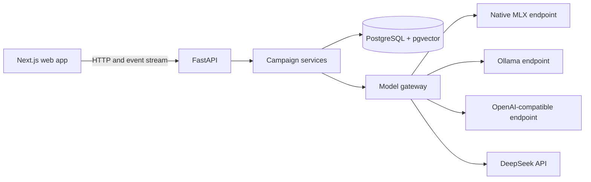
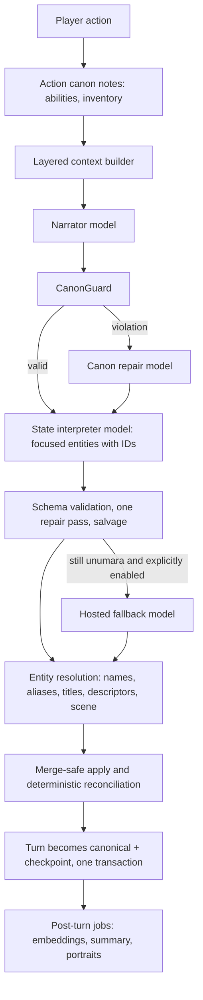

# Boundless architecture

Boundless separates browser presentation, campaign state, and model inference. PostgreSQL is the source of truth for campaigns. The model supplies narration and proposed state changes; the backend validates and persists them.

## Runtime layout

The root Compose file starts PostgreSQL, a one-shot Alembic migration service, the API, and the web app. Both application images are built from their own directories. Compose waits for PostgreSQL health and successful migrations before starting the API, then waits for API readiness before starting the web app. The application ports bind to host loopback. PostgreSQL data and Docker API secrets use named volumes.

The native workflow starts only PostgreSQL in Compose. FastAPI and Next.js run on the host. The Docker workflow can also use a native Apple Silicon MLX server through `host.docker.internal` when `HOST_MLX_SUPPORTED=true` is declared for that host. A loopback-only Mac companion lists downloaded models and launches the selected MLX server when asked by the API. `make stack-up` starts this companion on Apple Silicon Macs. Model endpoints and saved profiles decide which provider handles requests; saved MLX loopback URLs are mapped to the Docker host gateway.

## Campaign and canon

The original world prompt is preserved. `constitution.py` extracts the campaign premise, player details, rules, and permissions for hidden canon. Explicit hard rules have priority over derived state, summaries, and later improvisation. Hidden facts have visibility markers such as `GM_ONLY` and are filtered from player-facing lore responses.

`canon_guard.py` checks new narration against hard rules. The state service validates the model's proposed changes before writing them. A missing person is not treated as a confirmed death, and inventory must come from established state. Intentional `/canon`, `/retcon`, and `/ooc` commands take a separate meta-command path.

## Turn pipeline

A turn row starts non-canonical (`generating`, then `interpreting`). It becomes canonical only when the narration, state changes, and checkpoint commit together. A failed attempt is marked `failed` and never joins the story chain; retrying the same action reuses that row, so one logical turn never has several records.

### Identity

`Character.name` is the canonical name. `character_aliases` stores titles, descriptions, former names, and nicknames. `entity_resolver.py` turns a model-written reference into an ID using, in order: an explicit ID, the canonical name, aliases, normalized spelling, a unique title/role, descriptor variants (`bound merchant` / `merchant`) supported by the scene or first meeting place, and recency. When several people fit (`the guard`), it returns `AMBIGUOUS` and nothing is merged. Identity reveals in narration ("the woman in the dark coat … 'My name is Mara'") rename the existing person and keep the old description as an alias.

### No silent data loss

`character_store.py` applies updates with provenance (`PLAYER_EXPLICIT` > `CONFIRMED_CANON` > `DIRECT_OBSERVATION` > `RELIABLE_NPC_STATEMENT` > `INFERRED` > `RUMOR` > `MODEL_GUESS`). Empty and "unknown" values never replace known ones; a weaker source never replaces a stronger one; a less specific title ("High Archivist") never replaces a more specific one ("former High Archivist"). Facts live in `character_facts` and accumulate with near-duplicate detection; `attributes.known_facts` is kept as a read-only mirror. Only player edits and `/retcon`/`/canon` carry `PLAYER_EXPLICIT`.

### Deterministic reconciliation

After the model's operations: scene participants are updated from the narration (dialogue excluded), objectives complete when state already satisfies them (the item is in the inventory, the person has been met), completed objectives cannot reactivate without a retcon, duplicate items and objectives merge, relationship changes are clamped and deduplicated and must carry a concrete reason, and character importance (`BACKGROUND` … `MAJOR`, `COMPANION`) is recomputed from appearances, relationships, and objectives. Each turn stores structured diagnostics (resolution decisions, rejected operations, reconciliation notes, canon notes, metrics); raw model output is kept only when `STATE_DEBUG=true`.

### Memory

Memories are typed (`DISCOVERY`, `PROMISE`, `BETRAYAL`, `ABILITY_GAINED`, …, and a low-weight `TURN` transcript) and deduplicated by normalized hash and wording similarity. Embeddings are added by a post-turn job through `EmbeddingProvider` (default: a local hashed embedding that never leaves the machine; `EMBEDDING_PROVIDER=ollama|openai-compatible` for model embeddings). Retrieval is hybrid: pgvector similarity, entity match, lexical overlap, importance, recency by turn, and confidence.

### Model roles

The narrator is the active model profile. State tracking, summary, and canon repair can each use their own model; otherwise state and canon repair use the narrator, and summary uses the state model. A hosted state fallback runs only when the user enables it, because it receives the player action, the narration, and relevant campaign state.

### Living profile and scene mood

The protagonist's traits, goals, history, world rules, and reputation start from the premise and then follow the story. Every few turns (and on demand with "Refresh from story"), the bookkeeping model proposes additions, updates, and retirements; completed objectives become history deterministically. Nothing is deleted: a changed or finished entry is kept as "past" with the turn and reason, so the sheet shows how the character changed. The profile lives in branch state, so rewinds and branches keep their own version, and the GM context receives the current profile.

Each turn also records a scene mood (calm, tense, danger, combat, mystery, grief, romance, triumph, eerie, wonder) from the interpreter or, as a fallback, from the narration itself. The web app layers it over the campaign's theme family together with the in-world time of day. It changes presentation only, never canon, and can be turned off per device.

### Repair

`repair_service.py` (`python -m app.cli repair-campaign <id>` or the Journal → Health tab) reports duplicate people, lost facts and roles, stale or duplicate objectives, duplicate items and memories, empty relationships, stale summaries, truncated statuses, and stuck world time. High-confidence findings apply automatically; probable and ambiguous ones apply only when selected. Merges keep every fact, alias, relationship, memory reference, portrait, and history entry.

## Versioning and portability

Branches have their own current state and head turn. Rewind restores a checkpoint. Editing or regenerating a Game Master response creates a new version and reinterprets the affected state. Branching clones the state at a fork point so timelines diverge independently.

Campaign exports are versioned JSON (version 2). They contain campaign data, branches, canonical turns, state, checkpoints, aliases, facts, relationship events, abilities, memory metadata, and hidden GM facts, but omit API keys and failed attempts. Version 1 files are upgraded on import. Treat the export as private. Imports validate the format and write to PostgreSQL. A PostgreSQL volume is the installation's live state; exports are portable backups for individual campaigns.

## Provider and secret boundaries

`backend/app/llm/` defines the provider interface and implementations for MLX, Ollama, OpenAI-compatible APIs, and DeepSeek. Ollama model discovery uses `/api/tags`; OpenAI-compatible and DeepSeek discovery use `/models`. Model profiles are stored in PostgreSQL. The API key is kept outside campaign records and exports.

The native API saves a DeepSeek key under the ignored `.secrets/` directory. The Docker API saves its key in a dedicated named volume mounted at the same path inside the container. The frontend receives only a boolean saying whether a key is configured. Hosted providers receive the selected story context when generation is requested.
