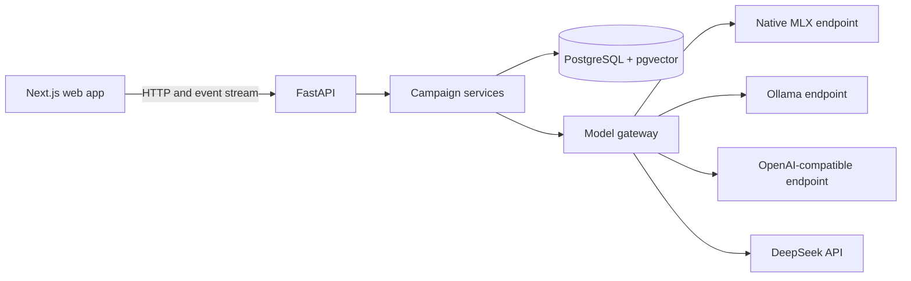
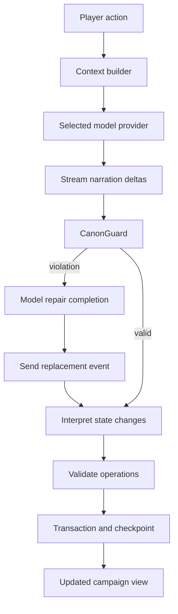

# Boundless architecture

Boundless separates browser presentation, campaign state, and model inference. PostgreSQL is the source of truth for campaigns. The model supplies narration and proposed state changes; the backend validates and persists them.

## Runtime layout

The root Compose file starts PostgreSQL, a one-shot Alembic migration service, the API, and the web app. Both application images are built from their own directories. Compose waits for PostgreSQL health and successful migrations before starting the API, then waits for API readiness before starting the web app. The application ports bind to host loopback. PostgreSQL data and Docker API secrets use named volumes.

The native workflow starts only PostgreSQL in Compose. FastAPI and Next.js run on the host. The Docker workflow can also use a native Apple Silicon MLX server through `host.docker.internal` when `HOST_MLX_SUPPORTED=true` is declared for that host. Model endpoints and saved profiles decide which provider handles requests; saved MLX loopback URLs are mapped to the Docker host gateway.

## Campaign and canon

The original world prompt is preserved. `constitution.py` extracts the campaign premise, player details, rules, and permissions for hidden canon. Explicit hard rules have priority over derived state, summaries, and later improvisation. Hidden facts have visibility markers such as `GM_ONLY` and are filtered from player-facing lore responses.

`canon_guard.py` checks new narration against hard rules. The state service validates the model's proposed changes before writing them. A missing person is not treated as a confirmed death, and inventory must come from established state. Intentional `/canon`, `/retcon`, and `/ooc` commands take a separate meta-command path.

## Turn pipeline

The context builder includes the Campaign Constitution and current state first, then adds relevant entities, memories, summaries, and recent turns within the selected model's budget. Hard canon is injected independently so summarization cannot weaken it. Long-term memories and campaign summaries help the model recover important facts without loading the full transcript each turn.

Narration streams to the browser as events. After a completed turn, the backend interprets and validates state changes, updates normalized records, and saves a checkpoint. If generation or interpretation fails, the API reports an actionable error instead of silently accepting invalid state.

## Versioning and portability

Branches have their own current state and head turn. Rewind restores a checkpoint. Editing or regenerating a Game Master response creates a new version and reinterprets the affected state. Branching clones the state at a fork point so timelines diverge independently.

Campaign exports are versioned JSON. They contain campaign data, branches, turns, state, checkpoints, and hidden GM facts, but omit API keys. Treat the export as private. Imports validate the format and write to PostgreSQL. A PostgreSQL volume is the installation's live state; exports are portable backups for individual campaigns.

## Provider and secret boundaries

`backend/app/llm/` defines the provider interface and implementations for MLX, Ollama, OpenAI-compatible APIs, and DeepSeek. Ollama model discovery uses `/api/tags`; OpenAI-compatible and DeepSeek discovery use `/models`. Model profiles are stored in PostgreSQL. The API key is kept outside campaign records and exports.

The native API saves a DeepSeek key under the ignored `.secrets/` directory. The Docker API saves its key in a dedicated named volume mounted at the same path inside the container. The frontend receives only a boolean saying whether a key is configured. Hosted providers receive the selected story context when generation is requested.
